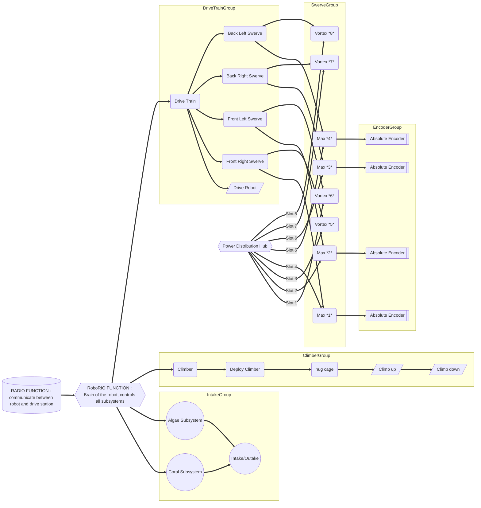

```mermaid


graph LR;
    PDH{{Power Distribution Hub}};
    RoboRIO==>CoralSubsystem;
    RoboRIO==>AlgeaSubsystem;
    RoboRIO==>ClimberSystem

    subgraph IntakeGroup
        direction LR
        CoralSubsystem((Coral Subsystem))==>IntakeOSystem;
        AlgeaSubsystem((Algae Subsystem))==>IntakeOSystem;
        IntakeOSystem((Intake/Outake));
    end


    subgraph ClimberGroup
        direction LR
        ClimberSystem(Climber);
        DeployClimber(Deploy Climber);
        ClimberSystem==>DeployClimber;
        DeployClimber ==> CageHug;
        CageHug(hug cage);
        CageHug ==> FUNCCLIMBER1;
        FUNCCLIMBER1[/Climb up/]==>FUNCCLIMBER2
        FUNCCLIMBER2[/Climb down/]
    end


    subgraph DriveTrainGroup
        direction LR
        DriveTrain(Drive Train);
        DriveTrain==>FUNCDRIVE[/Drive Robot/];
        DriveTrain==>FrontRightSwerve(Front Right Swerve);
        DriveTrain==>FrontLeftSwerve(Front Left Swerve);
        DriveTrain==>BackRightSwerve(Back Right Swerve);
        DriveTrain==>BackLeftSwerve(Back Left Swerve);
    end

    subgraph SwerveGroup
        direction LR
        FrontRightSwerve==>MaxFR(Max *1*);
        FrontLeftSwerve==>MaxFL(Max *2*);
        BackRightSwerve==>MaxBR(Max *3*);
        BackLeftSwerve==>MaxBL(Max *4*);
        FrontRightSwerve==>VortexFR(Vortex *5*);
        FrontLeftSwerve==>VortexFL(Vortex *6*);
        BackRightSwerve==>VortexBR(Vortex *7*);
        BackLeftSwerve==>VortexBL(Vortex *8*);
    end

    subgraph EncoderGroup
        direction LR
        MaxFR==>EncoderFR[[Absolute Encoder]];
        MaxFL==>EncoderFL[[Absolute Encoder]];
        MaxBR==>EncoderBR[[Absolute Encoder]];
        MaxBL==>EncoderBL[[Absolute Encoder]];
    end

    RADIO[(RADIO FUNCTION : communicate between robot and drive station)]==>RoboRIO;
    RoboRIO{{RoboRIO FUNCTION : Brain of the robot, controls all subsystems}}==>DriveTrain;


    PDH==>|Slot 1|VortexFL
    PDH==>|Slot 2|MaxFL
    PDH==>|Slot 3|VortexFR
    PDH==>|Slot 4|MaxFR
    PDH==>|Slot 5|MaxBL
    PDH==>|Slot 6|MaxBR
    PDH==>|Slot 7|VortexBR
    PDH==>|Slot 8|VortexBL


```
