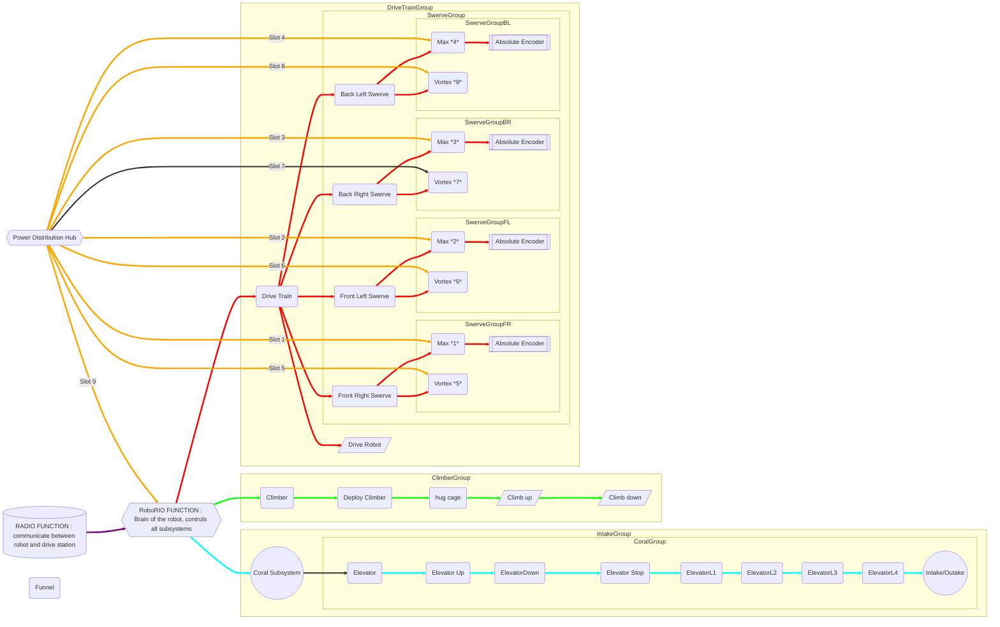

```mermaid

graph LR;
    PDH{{Power Distribution Hub}};
    RoboRIO==>CoralSubsystem;
    RoboRIO==>ClimberSystem

    subgraph IntakeGroup
        direction LR
        CoralSubsystem((Coral Subsystem))==>Elevator;
        IntakeOSystem((Intake/Outake));
        subgraph CoralGroup
                direction LR
                Elevator(Elevator) ==> ElevatorUp;
                ElevatorUp(Elevator Up) ==> ElevatorDown;
                ElevatorDown(ElevatorDown) ==> ElevatorStop;
                ElevatorStop(Elevator Stop) ==> ElevatorL1;
                ElevatorL1(ElevatorL1) ==> ElevatorL2;
                ElevatorL2(ElevatorL2) ==> ElevatorL3;
                ElevatorL3(ElevatorL3) ==> ElevatorL4;
                ElevatorL4(ElevatorL4) ==> IntakeOSystem;
        end
    end

    subgraph ClimberGroup
        direction LR
        ClimberSystem(Climber);
        DeployClimber(Deploy Climber);
        ClimberSystem==>DeployClimber;
        DeployClimber ==> CageHug;
        CageHug(hug cage);
        CageHug ==> FUNCCLIMBER1;
        FUNCCLIMBER1[/Climb up/]==>FUNCCLIMBER2
        FUNCCLIMBER2[/Climb down/]
    end

    subgraph DriveTrainGroup
        direction LR
        DriveTrain(Drive Train);
        DriveTrain==>FUNCDRIVE[/Drive Robot/];
        DriveTrain==>FrontRightSwerve(Front Right Swerve);
        DriveTrain==>FrontLeftSwerve(Front Left Swerve);
        DriveTrain==>BackRightSwerve(Back Right Swerve);
        DriveTrain==>BackLeftSwerve(Back Left Swerve);

subgraph SwerveGroup
        direction LR
        FrontRightSwerve==>MaxFR(Max *1*);
        FrontLeftSwerve==>MaxFL(Max *2*);
        BackRightSwerve==>MaxBR(Max *3*);
        BackLeftSwerve==>MaxBL(Max *4*);
        FrontRightSwerve==>VortexFR(Vortex *5*);
        FrontLeftSwerve==>VortexFL(Vortex *6*);
        BackRightSwerve==>VortexBR(Vortex *7*);
        BackLeftSwerve==>VortexBL(Vortex *8*);

        subgraph SwerveGroupFR
        direction LR
        MaxFR
        VortexFR
        MaxFR==>EncoderFR[[Absolute Encoder]];
        end

        subgraph SwerveGroupFL
        direction LR
        MaxFL
        VortexFL
        MaxFL==>EncoderFL[[Absolute Encoder]];
        end

        subgraph SwerveGroupBR
        direction LR
        MaxBR
        VortexBR
        MaxBR==>EncoderBR[[Absolute Encoder]];
        end

        subgraph SwerveGroupBL
        direction LR
        MaxBL
        VortexBL
        MaxBL==>EncoderBL[[Absolute Encoder]];
        end
    end
    end

    

    RADIO[(RADIO FUNCTION : communicate between robot and drive station)]==>RoboRIO;
    RoboRIO{{RoboRIO FUNCTION : Brain of the robot, controls all subsystems}}==>DriveTrain;
    
    PDH==>|Slot 1|MaxFR
    PDH==>|Slot 2|MaxFL
    PDH==>|Slot 3|MaxBR
    PDH==>|Slot 4|MaxBL
    PDH==>|Slot 5|VortexFR
    PDH==>|Slot 6|VortexFL
    PDH==>|Slot 7|VortexBR
    PDH==>|Slot 8|VortexBL
    PDH==>|Slot 9|RoboRIO

    linkStyle 34,35,36,37,38,39,41,42 stroke-width:4px,fill:none,stroke:orange;
    linkStyle 15,16,17,18,19,20,21,22,23,24,25,26,27,28,29,30,31,33 stroke-width:4px,fill:none,stroke:red; 
    linkStyle 0,3,4,5,6,7,8,9,10 stroke-width:4px,fill:none,stroke:cyan;
    linkStyle 1,11,12,13,14 stroke-width:4px,fill:none,stroke:lime; 
    linkStyle 32 stroke-width:4px,fill:none,stroke:purple;


    Funnel(Funnel)

```

<b> This was last updated by Anthony on Jan 27, 2025</b>
